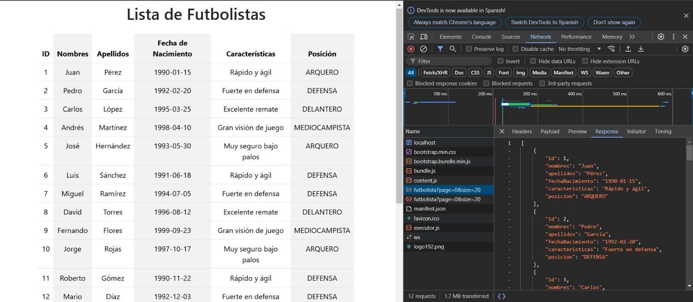
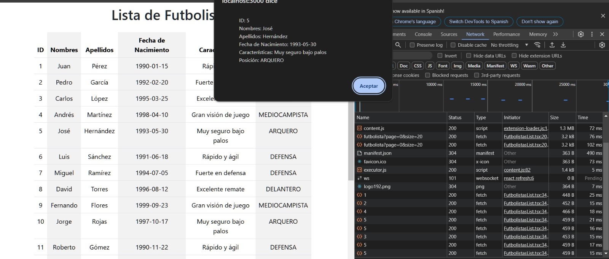

# Lista de Futbolistas App ⚽  🚀 

## Descripción

Una aplicación simple en React que consume y muestra una lista de futbolistas desde una API backend. 
La aplicación muestra los detalles de los futbolistas en una tabla y permite a los usuarios ver más detalles de cada futbolista haciendo clic en una fila de la tabla.

## Características

- Muestra una lista de futbolistas en una tabla.
- Obtiene datos de futbolistas desde una API backend.
- Muestra información detallada sobre un futbolista en un alert al hacer clic en una fila de la tabla.
- Utiliza Bootstrap para el diseño.

## Cómo Empezar

### Requisitos Previos

- Node.js (v16 o superior)
- npm (v8 o superior)

### Instalación

1. Clona el repositorio:
   ```bash
     git clone https://github.com/tuusuario/tu-repositorio.git
     cd tu-repositorio
   ```
   
2. Instala las dependencias:
    ```bash
     npm install
    ```
    
3. npm start
   
   ```bash
     npm start
    ```

4. Abre tu navegador y ve a **http://localhost:3000** para ver la aplicación en funcionamiento.

### Endpoints de la API

* `GET /futbolista`: Obtiene una lista de todos los futbolistas.
  
  
  
* `GET /futbolista/{id}`: Obtiene información detallada sobre un futbolista específico por ID.
  
  

### Uso
Haz clic en cualquier fila de la tabla para ver la información detallada del futbolista seleccionado. Los detalles se mostrarán en un alert.

### Contribuciones
Si deseas contribuir, siéntete libre de bifurcar el repositorio y enviar pull requests. Para problemas o solicitudes de características, por favor abre un issue en el repositorio. 😊 
